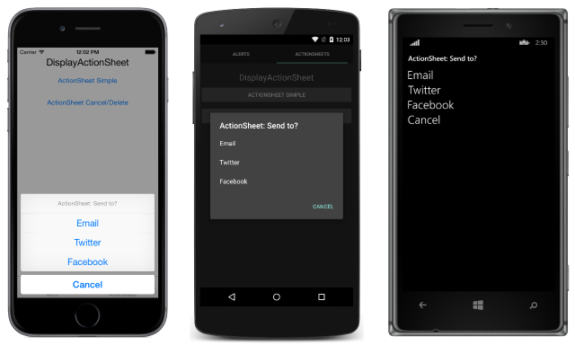
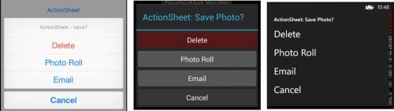

# How display Action Sheet in Xamarin.Forms

``` cs
 DisplayActionSheet("Title","Cancel","Destruction","Button1","Button2","Button3",...);
```

### The UIActionSheet is a common UI element in iOS. The Xamarin.Forms DisplayActionSheet method lets you include this control in cross-platforms apps, rendering native alternatives in Android and Windows Phone.

>To display an action sheet, await DisplayActionSheet in any Page, passing the message and button labels as strings. The method returns the string label of the button that was clicked by the user. A simple example is shown here:

``` cs
        private async void displayActionSheetBtn_Clicked(object sender, EventArgs e)
        {
            var actionSheet = await DisplayActionSheet("Title","Cancel", null, "Button1","Button2","Button3");

            switch (actionSheet)
            {
                case "Cancel":
                
                    // Do Something when 'Cancel' Button is pressed
                
                    break;

                case "Button1":

                    // Do Something when 'Button1' Button is pressed

                    break;

                case "Button2":

                    // Do Something when 'Button2' Button is pressed

                    break;
                case "Button3":

                    // Do Something when 'Button3' Button is pressed

                    break;

            }
            
        }

```



<br/>
<br/>
<br/>

>### The destroy button is rendered differently than the others, and can be left null or specified as the third string parameter. The following example uses the destroy button:

``` cs

 var actionSheet = await DisplayActionSheet("Title","Cancel","Destruction","Button1","Button2","Button3");

            switch (actionSheet)
            {
                case "Cancel":
                
                    // Do Something when 'Cancel' Button is pressed
                
                    break;

                case "Destruction":

                    // Do Something when 'Destruction' Button is pressed

                                        .
                                        .
                                        .                    

```

